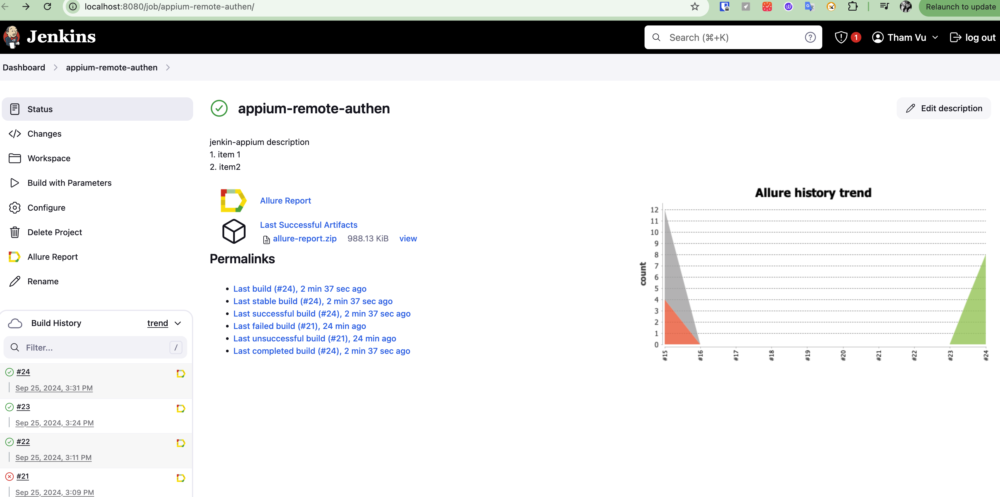

# Appium Project with Java

Learn Appium with Java

# Prerequisite setup

- Java LTS ( 17)
- Maven
- Appium 2.0 (latest)
- Appium driver ( UiAutomator2 , XCUitest)
- Appium Java Client 9.2.2 (stable)
- Appium Inspector ( get locator)
- Android SDK
- Allure
- TestNG
- IDE: IntelliJ

# Run Test

## Run on local

#### Prerequisite env

- Run appium server:
    - `appium`
- Setup devices
    - update device udid for mobile properties files on devicesOnLocal folder.
        - Ex: `deviceCapConfig/devicesOnLocal/android/mobile1.properties`

- Run sequence methods suite (total time: `1m 42s`)
    - `mvn test -Psequence-test-on-local-server -DmobileRunMode=local`
    - 
- Run parallel methods `parallelMethodsOnSeleniumGrid.xml` suite on local (total time: `43s 499ms`)
    - `mvn test -Pparallel-methods-on-local-server -DmobileRunMode=local`
    -  

- Run parallel classes  `parallelClassesOnSeleniumGrid.xml` suite:
    - `mvn test -Pparallel-test-on-selenium-grid -DmobileRunMode=local`

## Run Remote ( Selenium Grid 4)

#### Prerequisite env

- [Selenium Grid setup](https://appium.io/docs/en/2.0/guides/grid/):
    - Run Appium Server with configure ( appium1.yml file)
        ```
      # appium1.yml
      server:
      address: "2402:800:6341:fc8f:7136:edae:748a:86db"
      port: 4723
      keep-alive-timeout: 80
      use-drivers:
        - uiautomator2
        ```
    - Register Nodes
        - Example:(node1.toml file)
            ```
              #node1.toml
              [server]
              port = 5555
              
              [node]
              detect-drivers = false
              
              [relay]
              url = "http://[2402:800:6341:fc8f:7136:edae:748a:86db]:4723"
              status-endpoint = "/status"
              protocol-version = "HTTP/1.1"
              configs = [
              '1', '{"platformName": "android",  "appium:udid": "192.168.1.10:5555", "appium:automationName": "uiautomator2"}'
              ]
             ```           

              - Register node: java -jar "$FILE_PATH"/selenium-server-4.24.0.jar node --config "
                $CONFIG_FILE_PATH/node1.toml"
    - [Run Hub](https://appium.io/docs/en/2.0/guides/grid/):
        - `java -jar $FILE_PATH/selenium-server-4.24.0.jar hub --host [2402:800:6341:fc8f:7136:edae:748a:86db] --port 4444`
            -  

- Run parallel methods `parallelMethodsOnSeleniumGrid.xml` suite ( total time: `28s 163ms`:
    - `mvn test -Pparallel-methods-on-selenium-grid -DmobileRunMode=selenium_grid`
        - 

- Run parallel classes `parallelClassesOnSeleniumGrid.xml` suite:
    - `mvn test -Pparallel-classes-on-selenium-grid -DmobileRunMode=selenium_grid`
- Run parallel tests `parallelTestsOnSeleniumGrid.xml` suite:
    - `mvn test -Pparallel-test-on-selenium-grid -DmobileRunMode=selenium_grid`
- Set up run on Jenskins
  - Prepare env for the jenkins executor:
      - Java JDK installed
      - Maven
          -  Go to **Manage jenkins** > **Tools** (http://localhost:8080/manage/configureTools/)
          - Add Maven name
          - Add Maven_Home
              - If Maven already installed then run command : `mvn -v` to get MAVEN_HOME
      - Allure report plugin
          - Go to **Plugin** search Allure.
          - Select allure plugin then apply
          - Go to Manage Jenkins > Tools
              - Add Allure command line:
                  - Name
                  - Install automatically ( select version)
          - Parameter Trigger plugin
      - download jenkins (LTS)
        - Command start Jenkins: 
          - `java -jar path/jenkins.war`
        - Configure Jenkins
  -  

